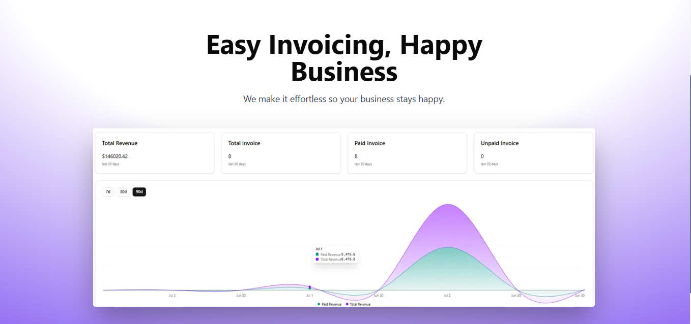

# 🧾 Invoice Generator

A professional and customizable invoice generator built with **Next.js 15**, supporting personalized logos, signatures, color themes, and custom bank details. Designed for simplicity and performance, it allows users to create, customize,edit  and manage invoices — all from the browser, without a custom Node.js server.

🔗 **Live Demo:** [https://invoice-six-orcin.vercel.app/](https://invoice-six-orcin.vercel.app/)  
📂 **GitHub Repo:** [github.com/Prasadpund2020/invoice](https://github.com/Prasadpund2020/invoice)

---

## 📸 Screenshots

<!-- Add your screenshots here -->


---

## ✨ Features

- 🧾 Generate clean, professional invoices
- 🏦 Input custom bank/payment details
- 🖼️ Upload your logo and signature (Cloudinary support)
- 🎨 Choose custom invoice colors
- 💾 Save and manage invoices in MongoDB
- 🔐 User authentication with NextAuth
- ☁️ Cloud-based asset storage via Cloudinary
- 🌍 Deployed on Vercel

---

## 🛠 Tech Stack

- [Next.js 15](https://nextjs.org/)
- [MongoDB Atlas](https://www.mongodb.com/cloud/atlas)
- [NextAuth.js](https://next-auth.js.org/)
- [Cloudinary](https://cloudinary.com/)
- [Vercel](https://vercel.com/)

---

## 🚀 Getting Started

### Prerequisites

- Node.js >= 18
- npm or yarn

### Installation

```bash
git clone https://github.com/Prasadpund2020/invoice.git
cd invoice
npm install
```

### Development

```bash
npm run dev
```

Visit [http://localhost:3000](http://localhost:3000) in your browser.

---

## 🔐 Environment Variables

Create a `.env.local` file in the root of the project and add the following variables:

```env
NEXTAUTH_SECRET=
MONGODB_URI=
AUTH_RESEND_KEY=
CLOUDINARY_CLOUD_NAME=
CLOUDINARY_API_KEY=
CLOUDINARY_API_SECRET=
```


## 🚢 Deployment

This project is deployed with **Vercel**.

To deploy your own copy:

1. Push the code to your GitHub
2. Connect the repo to [Vercel](https://vercel.com/)
3. Set the required environment variables
4. Deploy

---

## 📁 Folder Structure

```bash
/app
/assets
/components 
/hooks 
/lib
/models 
/public
/scripts

```

---

## 🤝 Contributing

Contributions are welcome!  
Feel free to open issues, suggest improvements, or submit pull requests.

---


## 🙏 Acknowledgements

- [Next.js Documentation](https://nextjs.org/docs)
- [NextAuth.js](https://next-auth.js.org/)
- [MongoDB Atlas](https://www.mongodb.com/cloud/atlas)
- [Cloudinary](https://cloudinary.com/documentation)
- [Vercel](https://vercel.com/)

---